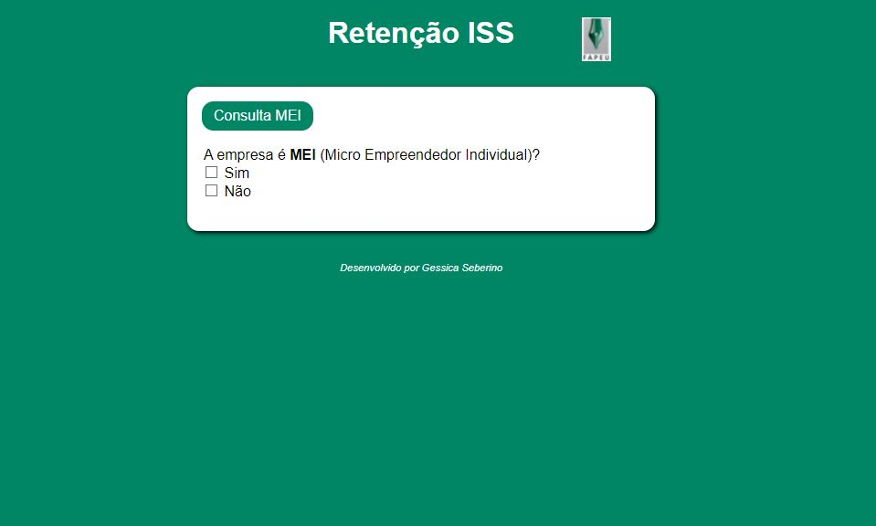

  

<h2> :page_with_curl: Sobre a aplicação </h2>

 Projeto simples criado em 2020 para auxiliar no setor financeiro e verificar se há retenção do imposto ISS em notas fiscais de serviço conforme código 
fornecido na nota fiscal para pagamento e a alíquota correta a ser utilizada com base nas perguntas de Sim/Não.

<h2> :rocket: Tecnologias utilizadas </h2>

<h3>Front-end</h3>

HTML  
CSS  
JavaScript  

<h2> :computer: Utilização </h2>

Basta baixar e abrir em um navegador.

